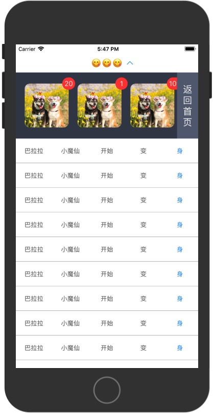

# LFDragHead
下拉头部
基于MJRefreshBaseView，创建LFTableHeaderView，用法如下：

1.新增
-(void)addLFHeaderWithClassName:(NSString*)className callback:(void (^)())callback；

2.展开
- (void)showLf_header；

3.隐藏
- (void)hideLf_header;

通过对LFTableHeaderView新增属性，例如CPDHeadCollectionView（头部展开的深色CollectionView视图），也可自行定义

